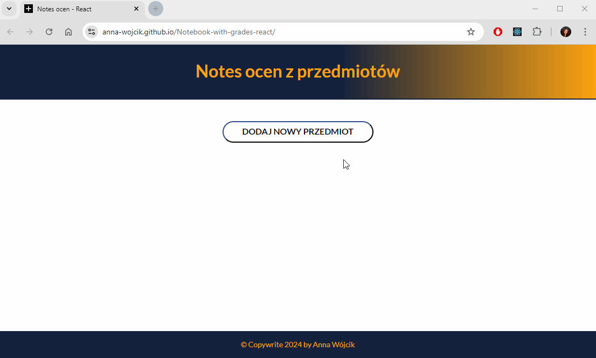

# Notebook with grades
The subject of the project is notebook with grades in subjects. The notebook allows to add as well as remove subjects and marks. 
 Here is a working live demo: https://anna-wojcik.github.io/Notebook-with-grades-react/ 
 This project was bootstrapped with [Create React App](https://github.com/facebook/create-react-app).

## Table of Contents 
* [Description](#description)
* [Technologies Used](#technologies-used)
* [Gif](#gif)
* [Available Scripts](#available-scripts)
* [Project Status](#project-status)
* [Acknowledgments](#acknowledgments)
* [Author](#author)

## Description
This website depicts a notebook with grafes in subjects. It is very easy to use. In the middle of the page is button that adds new subject to the list. When the name of new subject was entered you have click on next button to add subject. After that you can click "plus" button to add new mark. Before that you will be forced to enter: grade, for what, importance of grade. Notebook allows you to delete subject (click on red "X") and also delete mark (click on button "Usuń").

## Technologies Used
- JavaScript
- React
- HTML 5
- CSS 3
- Normalize CSS
- BEM Convention
- Grid
- Flex
- Media Queries

## Gif

## Available Scripts
In the project directory, you can run:

### `npm start`
Runs the app in the development mode.\
Open [http://localhost:3000](http://localhost:3000) to view it in your browser.

The page will reload when you make changes.\
You may also see any lint errors in the console.

### `npm run build`
Builds the app for production to the `build` folder.\
It correctly bundles React in production mode and optimizes the build for the best performance.

The build is minified and the filenames include the hashes.\
Your app is ready to be deployed!

See the section about [deployment](https://facebook.github.io/create-react-app/docs/deployment) for more information.

### `npm run eject`
**Note: this is a one-way operation. Once you `eject`, you can't go back!**

If you aren't satisfied with the build tool and configuration choices, you can `eject` at any time. This command will remove the single build dependency from your project.

Instead, it will copy all the configuration files and the transitive dependencies (webpack, Babel, ESLint, etc) right into your project so you have full control over them. All of the commands except `eject` will still work, but they will point to the copied scripts so you can tweak them. At this point you're on your own.

You don't have to ever use `eject`. The curated feature set is suitable for small and middle deployments, and you shouldn't feel obligated to use this feature. However we understand that this tool wouldn't be useful if you couldn't customize it when you are ready for it.

## Project Status
Project is finished now. However, during the acquisition of new knowledge, the project will be expanded.

## Acknowledgments
This project was made thanks to the knowledge gained on the course "Frontened Developer from the basis" run by online programming school YouCode.

## Author 
Created by Anna Wójcik.